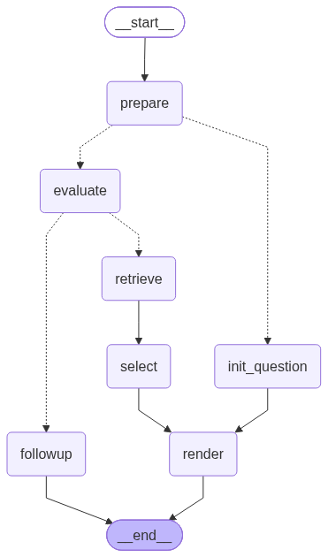
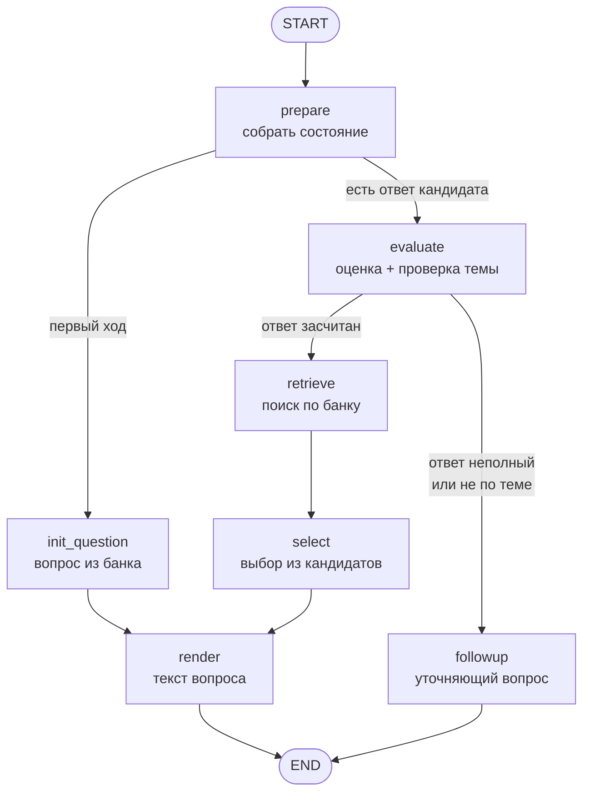

# ИИ-интервьюер

Веб-сервис, проводящий тренировочное техническое собеседование по ML и MLOps:
задаёт вопрос, разбирает ответ по заранее заданным критериям и решает,
углубиться в ту же тему или перейти к следующей. Логика диалога — граф на LangGraph, вопросы подбираются
семантическим поиском по банку, языковая модель работает локально через LM Studio.

Проект написан с нуля: агент, ретривал, оценка ответов и интерфейс.

<p align="center">
  
</p>

<p align="center"><sub>Схема сгенерирована из скомпилированного графа
командой <code>uv run python -m tools.render_graph</code> — она не может
разойтись с кодом.</sub></p>

---

## Как устроен ход интервью



Один вызов графа — один ход диалога. Состояние между ходами живёт в
`MemorySaver`, сессии разделены по `thread_id`.

**prepare** нормализует состояние и достаёт последний ответ кандидата.
Первый ход отличается тем, что оценивать ещё нечего, поэтому маршрут
расходится сразу: `init_question` берёт стартовый вопрос из банка случайно
(генератор случайных чисел передаётся аргументом — так ветку можно
детерминированно тестировать), дальше сразу рендер.

**evaluate** делает две разные вещи и намеренно не смешивает их. Сначала
оценщик сверяет ответ с `rubric` вопроса и возвращает `covered`, `missed`,
`score` от 0 до 1 и комментарий. Затем отдельный вызов решает более простой
вопрос — отвечает ли кандидат по теме вообще. Разделение нужно потому, что
это разные типы ошибок: слабый ответ по теме и уверенный ответ не о том
требуют разной реакции. У разделения есть измеренная цена — см. раздел
о производительности.

**route_after_evaluate** — единственное место, где принимается решение о
ходе интервью:

| Условие | Куда |
|---|---|
| оценки не было (модель недоступна) | `retrieve` — требовать доработки не за что |
| `score ≥ ON_TOPIC_OVERRIDE_SCORE` и `missed` пуст | `retrieve` — тема закрыта |
| не по теме, либо `score < DRIFT_SCORE_THRESHOLD`, либо не покрыт ни один аспект, либо пропущено почти всё | `followup` |
| иначе | `retrieve` |

**followup** возвращает кандидата к тому же вопросу, опираясь на пропущенные
аспекты. Он называет их прямо — это осознанный выбор: смысл уточняющего
вопроса в том, чтобы вернуть кандидата к недосказанному, а не загадать
вторую загадку. Подводка перед **новым** вопросом, наоборот, не должна
содержать ничего по его теме — иначе вопрос обесценивается, и за этим следит
отдельный фильтр в `sanitize_prefix`.

**retrieve → select** ищет следующий вопрос: по каждому выбранному домену
берётся top-3 семантически близких к последнему ответу, результаты
объединяются по `id`, из первых пяти кандидатов языковая модель выбирает один.
Если выбор не удался — берётся кандидат с максимальным сходством.

**render** добавляет короткую связку с предыдущим ответом. Сам текст вопроса
всегда берётся из банка и моделью не переписывается: подводка может быть
отброшена целиком, вопрос от этого не пострадает.

---

## Ретривал

Банк — 90 вопросов: домены `ml` и `mlops`, уровни `junior`, `middle`,
`senior`, по 15 в каждой из шести корзин. У каждого вопроса есть `rubric` —
список аспектов, по которым потом оценивается ответ.

Индексируется не текст вопроса, а собранная строка: вопрос, домен, тема,
уровень, ключевые понятия из `rubric` и теги. Смысл в том, что запросом
выступает **ответ кандидата**, а не вопрос — совпадать с ним по формулировке
он не будет, зато совпадёт по понятиям.

Индекс — FAISS `IndexFlatIP` по нормализованным эмбеддингам, то есть
внутреннее произведение равно косинусной близости. Полный перебор выбран
осознанно: на 90 векторах приближённый поиск не даёт ничего, кроме
дополнительного источника ошибок.

Модель эмбеддингов — `intfloat/multilingual-e5-base`, выбрана замером
(раздел ниже). У семейства e5 обязательны префиксы роли текста: `query: `
для запроса и `passage: ` для индексируемого документа. Префикс — деталь
конкретной модели, поэтому он применяется при кодировании, а сама
индексируемая строка его не содержит.

**Индекс хранит конфигурацию, которой собран**, и `load_index` сверяет её с
текущей. Индекс, собранный другой моделью, не даёт ошибки — он даёт молча
неправильный поиск, и это самый дорогой вид отказа в такой системе. При
расхождении сервис падает с указанием, чем собран индекс, что стоит в
конфигурации и какой командой пересобрать.

```bash
uv run python -m services.llm_service.rag.store
```

---

## Качество ретривала

Модель эмбеддингов выбрана замером, а не по описанию на HuggingFace.
Код — `benchmark/retrieval_benchmark.py`, данные — `benchmark/answers.json`,
сырые результаты с рангами каждого запроса — `benchmark/results.json`.

### Что измеряется

Прокси-задача, и это осознанно. В продакшене запросом выступает ответ
кандидата, а найти нужно **следующий** вопрос — но объективной разметки для
этого не существует, потому что «хороший следующий вопрос» есть суждение, а
не факт. Поэтому измеряется то, что от модели эмбеддингов действительно
зависит: способность сопоставить ответ кандидата с вопросом, **на который он
отвечает**. Здесь правильный ответ ровно один.

90 эталонных ответов написаны разговорным языком, без формулировок из
`rubric`: иначе поиск стал бы тривиальным и замер не различил бы модели.
Что этого удалось избежать, видно по лексическому бейзлайну — он берёт 0.49,
а не 0.95.

### Результаты

| Модель | Параметров | Recall@1 | Recall@3 | Recall@5 | MRR | Токенов | Кодирование |
|---|---|---|---|---|---|---|---|
| multilingual-e5-base **(выбрана)** | 278.0M | 0.444 | 0.656 | **0.800** | 0.588 | 24.4 | 8.9 с |
| multilingual-e5-large | 559.9M | 0.478 | 0.633 | 0.711 | 0.592 | 24.4 | 61.2 с |
| TF-IDF, символьные 3–5-граммы | — | 0.489 | 0.611 | 0.656 | 0.582 | — | 0.1 с |
| LaBSE | 471.5M | 0.433 | 0.644 | 0.700 | 0.559 | 23.0 | 8.0 с |
| multilingual-e5-small | 117.7M | 0.333 | 0.522 | 0.656 | 0.465 | 24.4 | 2.1 с |
| rubert-tiny2 | 29.2M | 0.367 | 0.489 | 0.567 | 0.458 | 19.5 | 0.4 с |
| paraphrase-multilingual-MiniLM-L12 | 117.7M | 0.300 | 0.556 | 0.600 | 0.450 | 24.4 | 2.6 с |
| all-MiniLM-L6-v2 *(стояла раньше)* | 22.7M | 0.022 | 0.100 | 0.156 | 0.098 | **85.7** | 5.8 с |

### Модель, которая стояла в проекте, работала на уровне случайного выбора

`all-MiniLM-L6-v2` даёт Recall@1 = 0.022 — это 2 попадания из 90, при том что
случайный выбор из 90 вопросов даёт ожидаемо 1. Статистически это от
случайности не отличить. MRR 0.098 против 0.0565 у случайного ранжирования:
слабый сигнал есть, но и всё.

Причина — в токенизаторе, и она измерена: **85.7 токена на ответ против
19.5–24.4 у остальных моделей.** Английский словарь режет русские слова на
посимвольные фрагменты. Отсюда же и то, что самая маленькая модель кодирует
дольше `rubert-tiny2`, который больше её: последовательности в три с
половиной раза длиннее.

Пока замера не было, дефект не проявлялся никак. Интервью шло, вопросы
приходили, и любой вопрос про ML выглядит уместным после любого ответа
про ML.

### Почему e5-base, а не самая сильная по MRR

Значимость проверена парным бутстрепом по 90 запросам — парным, потому что
все модели отвечали на одни и те же запросы, и пересэмплировать нужно
запросы, а не модели.

| Против e5-base | Δ Recall@5 | 95% ДИ | p |
|---|---|---|---|
| multilingual-e5-large | +0.089 | [+0.011, +0.167] | 0.032 |
| LaBSE | +0.100 | [+0.011, +0.189] | 0.031 |
| TF-IDF | +0.144 | [+0.056, +0.233] | 0.001 |
| multilingual-e5-small | +0.144 | [+0.056, +0.244] | 0.003 |
| all-MiniLM-L6-v2 | +0.644 | [+0.533, +0.744] | 0.000 |

Смотрим на Recall@5, потому что так устроен пайплайн: `retrieve_node` берёт
top-3 по каждому домену, в селектор уходят первые пять кандидатов, и
достаточно, чтобы нужный вопрос попал в пятёрку — дальше выбирает языковая
модель.

**По Recall@1 и MRR e5-base, e5-large, LaBSE и TF-IDF статистически
неразличимы** — все доверительные интервалы накрывают ноль. Преимущество
e5-base существует именно и только по Recall@5. Поэтому и утверждение узкое:
это не «лучшая модель», а «лучшая по метрике, которая соответствует
архитектуре пайплайна».

`e5-large` вдвое тяжелее, кодирует в семь раз дольше и по Recall@5 значимо
**хуже**. Кривая «качество от размера» немонотонна: LaBSE на 471M проигрывает
e5-base на 278M. Решает не размер, а целевая задача обучения — у e5 это
поиск в паре «запрос-документ», у LaBSE выравнивание переводов между языками.

### Чего этот замер не может

Разрешающая способность посчитана симуляцией: на 90 примерах разрыв в
14 п.п. по Recall@5 обнаруживается с мощностью около 0.6. Для устойчивого
различения близких моделей нужно порядка 200 примеров — там мощность 0.9.

Кроме того, метрика **занижает** качество: часть промахов вызвана смысловыми
дублями в банке, а не ошибками поиска. Ответ «новую версию показываем
небольшой доле пользователей и сравниваем с текущей» попадает в вопрос про
A/B-тест вместо canary — и попадает справедливо. Из 18 промахов e5-base
примерно треть такого рода.

Вводить «мягкую» метрику, где засчитывается любой похожий вопрос, я не стал:
это метрика, подогнанная под результат. Правильное решение — аудит банка на
смысловые пересечения, и он в списке дальнейших работ.

---

## Поведение при отказе модели

Локальная языковая модель — ненадёжный внешний сервис: она может быть не
загружена, перегружена или отвечать ошибкой. В системе, где каждый шаг
диалога генерируется моделью, такой отказ по умолчанию превращается либо в
падение, либо в правдоподобный мусор.

Поэтому **у каждого из пяти обращений к модели есть детерминированный путь
отступления**, не требующий сети:

| Узел | При отказе |
|---|---|
| оценка ответа | `available: False`, отличимый комментарий; маршрут ведёт к следующему вопросу, а не к претензии кандидату |
| проверка темы | ответ считается по теме |
| выбор вопроса | кандидат с максимальным косинусным сходством |
| подводка | вопрос выдаётся без подводки |
| уточняющий вопрос | вопрос собирается из исходного и первого пропущенного аспекта |

Отдельно обрабатывается вывод reasoning-моделей: блок `<think>…</think>`
вырезается, а обрыв генерации внутри него распознаётся как отсутствие
ответа, а не как ответ. Директива `/no_think` в системных промптах гасит
режим рассуждений там, где модель это поддерживает.

Это не теория: при недоступности LM Studio интервью проходит целиком, просто
без оценок — проверено сквозным прогоном.

---

## Запуск

Нужен работающий LM Studio с загруженной моделью и включённым локальным
сервером. Имя модели должно посимвольно совпадать с полем
«This model's API identifier» в интерфейсе LM Studio; при старте сервис
сверяет его со списком `/v1/models` и падает с перечислением доступных
имён, если совпадения нет.

### Docker

```bash
docker compose up --build web
```

Интерфейс — `http://localhost:7860`. Контейнер обращается к LM Studio на
хост-машине через `host.docker.internal`.

### Локально

```bash
uv sync
uv run python -m services.web_service.web_app
```

Консольный вариант того же графа: `uv run python -m services.orchestrator.main`.

### Тесты

```bash
uv run pytest -q
```

136 тестов, около пяти секунд. Тестируются чистые функции обработки текста,
правила подбора сложности, согласование индекса с конфигурацией и поведение
при недоступной модели — без сети, без языковой модели и без FAISS.
Интеграционные проверки, которым нужен живой LM Studio, лежат в
`manual_checks/` и в `pytest` не входят.

---

## Конфигурация

Все параметры читаются из переменных окружения, значения по умолчанию
рассчитаны на локальный запуск без `.env`. Образец — `.env.example`.

| Переменная | По умолчанию | Назначение |
|---|---|---|
| `LM_STUDIO_BASE_URL` | `http://127.0.0.1:1234/v1` | адрес LM Studio |
| `MODEL_NAME` | `qwen/qwen3-8b` | идентификатор модели |
| `EMBEDDING_MODEL_NAME` | `intfloat/multilingual-e5-base` | модель эмбеддингов |
| `EMBEDDING_QUERY_PREFIX` | `query: ` | префикс запроса (e5) |
| `EMBEDDING_PASSAGE_PREFIX` | `passage: ` | префикс документа (e5) |
| `DRIFT_SCORE_THRESHOLD` | `0.45` | ниже — уточняющий вопрос |
| `ON_TOPIC_OVERRIDE_SCORE` | `0.80` | выше и без пропусков — тема закрыта |
| `PROMPT_SUFFIX` | `/no_think` | директива отключения рассуждений |
| `STT_URL` | `http://127.0.0.1:8000/transcribe` | эндпоинт распознавания речи |

Смена `EMBEDDING_MODEL_NAME` или префиксов требует пересборки индекса.
Значения с концевым пробелом в `.env` пишутся в кавычках — иначе он
срезается при чтении, а для e5 `query:` и `query: ` это разные токены.

Адреса LM Studio и STT внутри контейнера заданы в `docker-compose.yml`
литерально и из `.env` не переопределяются: изнутри контейнера `127.0.0.1`
указывает на сам контейнер, а не на хост.

---

## Производительность

Замер на встроенной графике Intel UHD через Vulkan, модель `qwen/qwen3-8b`:

| Вызов | Время |
|---|---|
| оценка ответа | 51 с |
| проверка темы | 22 с |
| уточняющий вопрос | 31 с |
| **один ход диалога** | **≈104 с** |

Скорости: обработка промпта 14–16 токенов/с, генерация 4.1 токена/с. Из ста
секунд 61% уходит на обработку промптов и 37% на генерацию.

Такая доля обработки промпта объясняется тем, что у четырёх обращений
четыре разных системных промпта, а KV-кеш переиспользуется только по общему
началу: по логам сервера совпадает 0.6–1.9% промпта, то есть каждый вызов
считается практически с нуля.

Отсюда два направления ускорения, оба с понятной ценой: общая преамбула в
начале всех системных промптов (тогда кеш переиспользует её) и объединение
проверки темы с оценкой (минус целый вызов, около 20% хода — но исчезает
разделение двух типов ошибок, ради которого оно и делалось). Ни то, ни
другое не сделано.

Цифры относятся к этой машине. На дискретной видеокарте порядок будет другим.

---

## Ограничения

**Банк содержит смысловые дубли.** Часть вопросов пересекается по существу
(например A/B-тест и canary-выкатка), из-за чего бенчмарк занижает качество
поиска, а интервьюер может задать близкий вопрос дважды. Нужен аудит.

**Разрешающая способность бенчмарка ограничена.** 90 примеров различают
разрывы около 14 п.п. с мощностью 0.6. Близкие модели этим замером надёжно
не разделить.

**Выбор вопроса языковой моделью не сравнивался с более простыми способами.**
Неизвестно, лучше ли он, чем взять кандидата с максимальным сходством или
случайного из топ-5. При отказе модели пайплайн как раз и деградирует до
первого варианта — то есть baseline уже реализован, но не измерен.

**Память живёт в процессе.** `MemorySaver` хранит состояние в оперативной
памяти: после перезапуска контейнера все сессии теряются.

**Модель эмбеддингов не вшита в образ.** `sentence-transformers` скачивает её
при первом обращении, поэтому холодный старт требует доступа к HuggingFace,
а размер образа от выбора модели не зависит — зависят время первого запуска
и потребление памяти.

**Задержка.** Около ста секунд на ход на встроенной графике; на один ход
приходится до четырёх последовательных обращений к модели, и распараллелить
можно только первые два.

**Голосовой ввод в поставку не входит.** Интерфейс умеет отправлять запись на
эндпоинт `/transcribe`, `Dockerfile.stt` и сервис в `docker-compose.yml`
описаны, но реализации самого эндпоинта в репозитории нет. Сервис вынесен в
отдельный профиль и обычным `docker compose up` не поднимается:

```bash
docker compose --profile stt up
```

**Размер образа — 2.12 GB.** Изначально было около 3.9 GB: `torch` по
умолчанию тянет CUDA-библиотеки, которые сервису не нужны, потому что
эмбеддинги считаются на CPU. Сборка переведена на CPU-индекс PyTorch через
`[[tool.uv.index]]`, время сборки сократилось с двух часов до восьми минут.

---

## Что дальше

- Аудит банка на смысловые пересечения между вопросами
- Расширение бенчмарка до 200 примеров — порог, за которым близкие модели различимы
- Ablation селектора: языковая модель против top-1 по косинусу и случайного из топ-5
- Постоянный чекпоинтер вместо `MemorySaver`
- Ускорение: общая преамбула промптов, объединение оценки и проверки темы
- Реализация STT-сервиса

---

## Структура

```
services/
  llm_service/
    agents/agent.py         граф, узлы, маршрутизация, промпты
    agents/text_utils.py    чистые функции обработки текста
    evaluation/evaluator.py оценка ответа по rubric
    rag/store.py            построение и загрузка FAISS-индекса, сверка конфигурации
    rag/retriever.py        семантический поиск
    rag/api.py              фильтрация по домену, уровню, истории
  web_service/web_app.py    интерфейс на Gradio
  orchestrator/main.py      консольный запуск того же графа
  stt_service/              клиент распознавания речи
shared/
  config.py                 конфигурация из переменных окружения
  health.py                 сверка имени модели с сервером при старте
  questions/raw/            банк вопросов
  questions/index/          FAISS-индекс и метаданные
benchmark/                  бенчмарк ретривала, эталонные ответы, результаты
tools/render_graph.py       генерация схемы графа из кода
tests/                      тесты, не требующие сети
manual_checks/              проверки, требующие живого LM Studio
assets/                     схема графа
```
